# Smart Light 解决方案

### 解决方案部署
#### 1.参考 [README](./README.md) 文档进行硬件准备、环境搭建、SDK 准备

#### 2.阿里云平台部署
在阿里云 [生活物联网平台](https://living.aliyun.com/#/) 创建产品, 参考[创建产品文档](https://living.aliyun.com/doc#readygo.html).
> 配置较多, 如果不太懂, 也不用纠结, 后续都可以修改.

部署自己的产品, 可参考如下:
新增 RGB 调色功能:
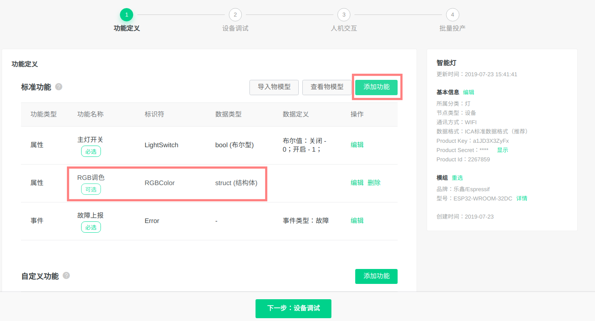

新增测试设备, 此处即可以获得`三元组`, 后续需要烧录到 NVS 分区.
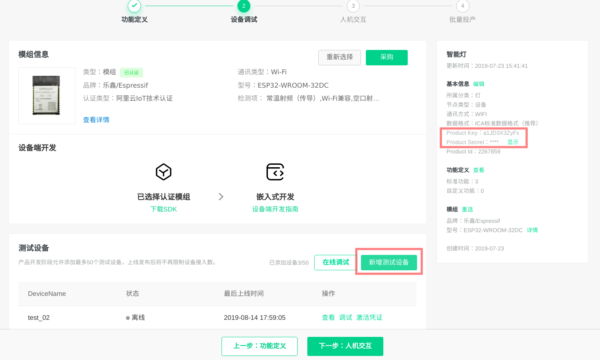
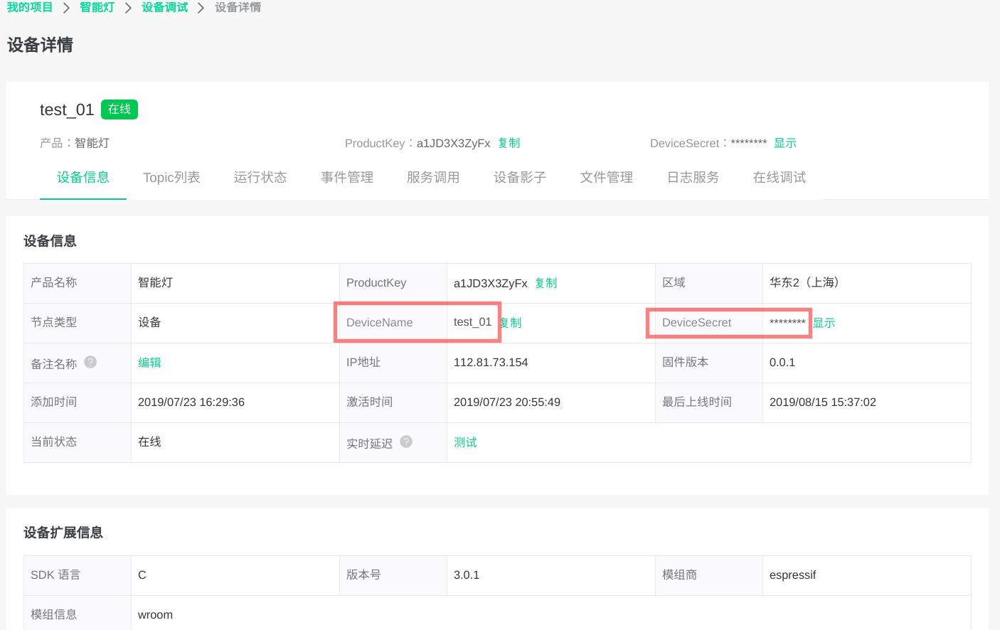

选择面板, 手机 APP 上会显示同样界面; `配网二维码`是贴在产品包装上, 终端客户给设备配网中需扫描此二维码.
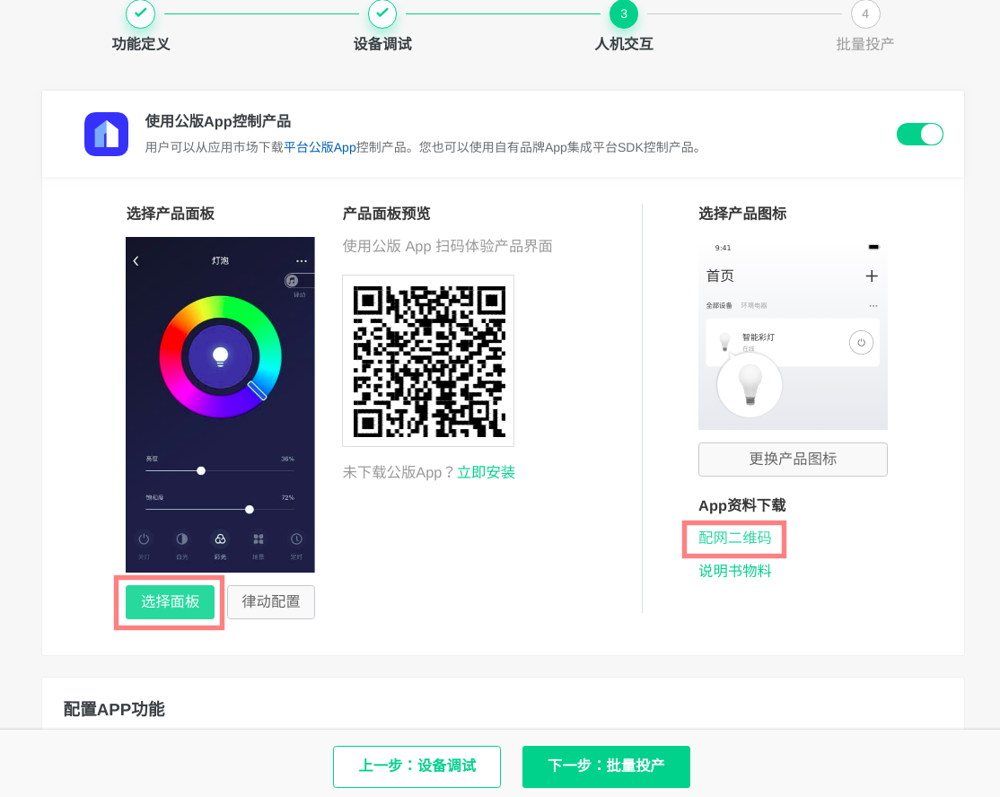

选择面板时, 主题面板在手机上仅能显示标准界面, 没有 RGB 调色功能. 可以自定义面板, 增加 RGB 调色.
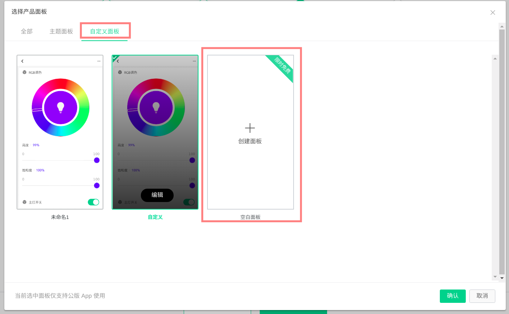

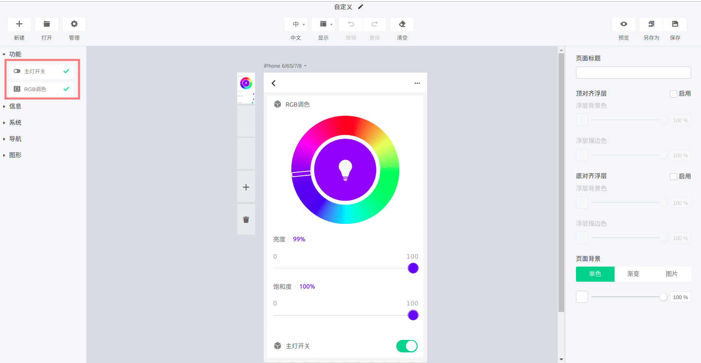

配网方案选择:
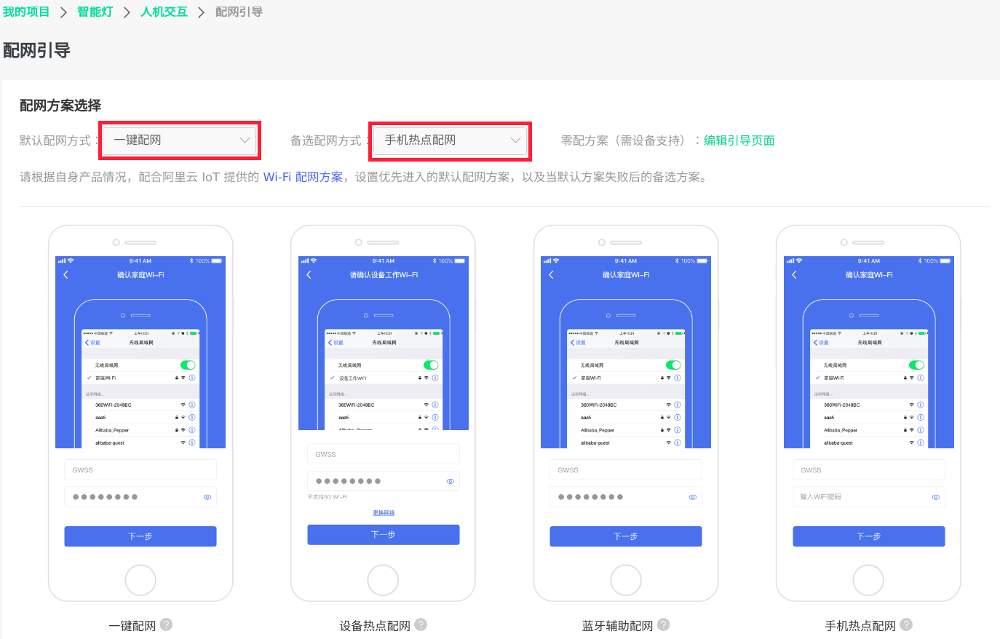

完成
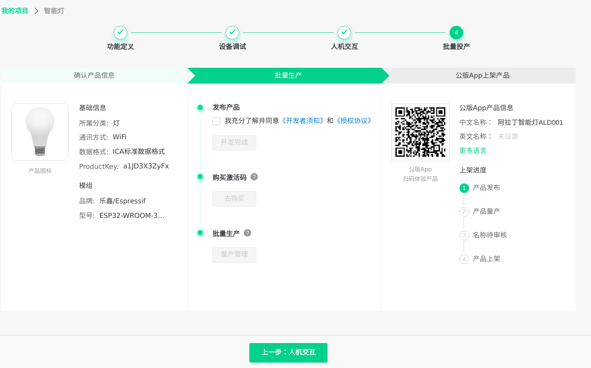

#### 3.下载本工程
   ```
    git clone https://github.com/espressif/esp-aliyun.git
    cd esp-aliyun
   ```

#### 4.烧录三元组信息
- 参考 [量产说明](../../../config/mass_mfg/README.md) 文档烧录三元组 NVS 分区.

> 如果执行了 `make erase_flash`, 需要重新烧录三元组.

#### 5.配置 `smart light example`
- RGB 灯分别接 ESP32/ESP8266 开发板上 `GPIO0`, `GPIO2`, `GPIO4` (可在 `lightbulb.c` 中修改)

#### 6.编译 `smart light` 并烧录运行
```
cd examples/solutions/smart_light
make chip=esp32 defconfig 或者 make chip=esp8266 defconfig
make -j8 flash monitor
```
使用 esp32s2 请参考根目录 README。

> 在测试配网中, 请先执行 `make erase_flash` .

#### 7.设备第一次运行时, 会进入配网

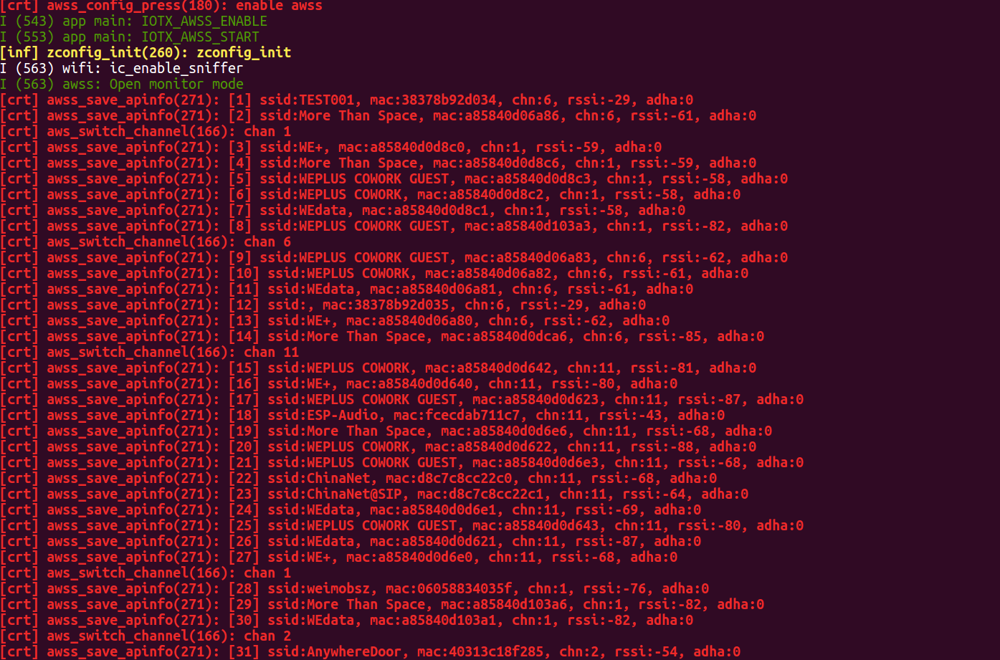

#### 8.手机从[阿里云官网](https://living.aliyun.com/doc#muti-app.html) 下载 `云智能` 公版 APP, 国内用户版.

#### 9.注册好账号后,进入 APP, 右上角扫描, 扫描第二步的二维码配网.
设备端配网成功后会保存 `ssid` 和 `password` :
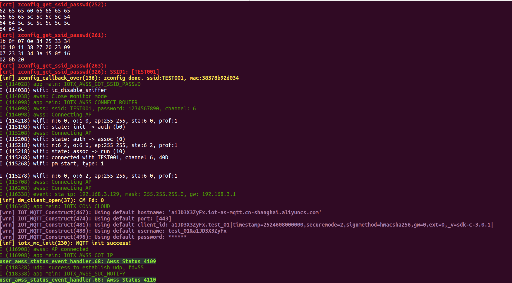

设备与手机绑定成功后, APP 上会弹出灯的配置页面. 返回主页显示灯 `在线`.  
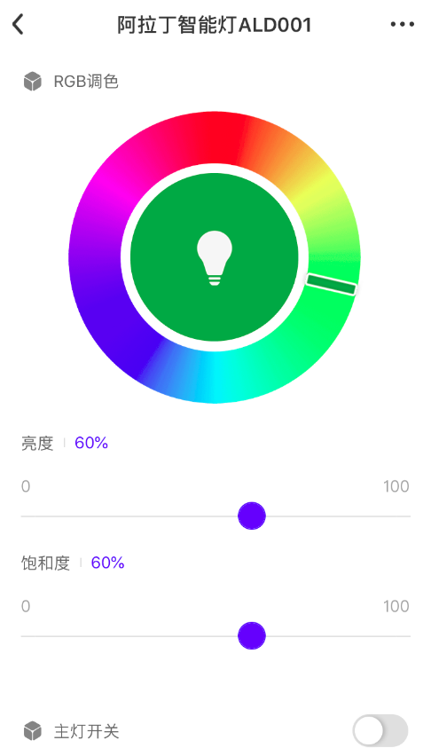
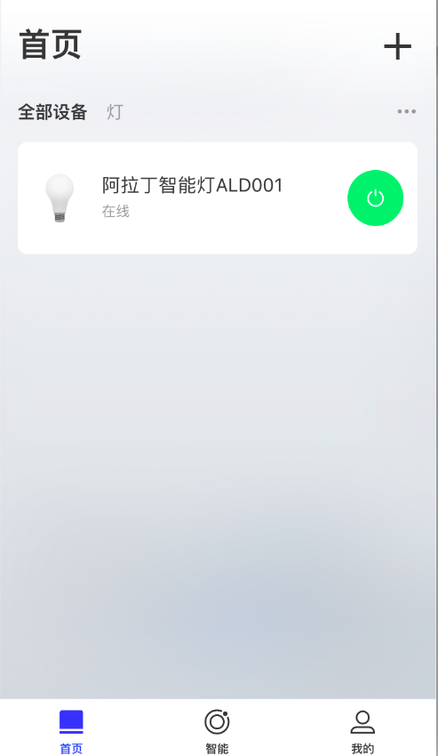

#### 10.控制智能灯

在 APP 上打开灯, 设备端收到消息:
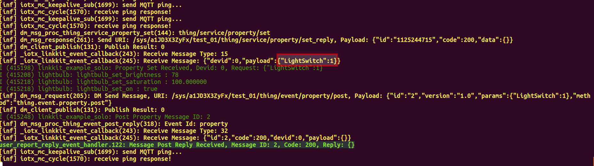

在 APP 上设置 RGB 调色:  
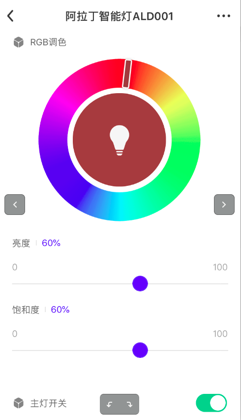

设备端即解析 RGB 颜色, 并设置到具体的灯产品上.
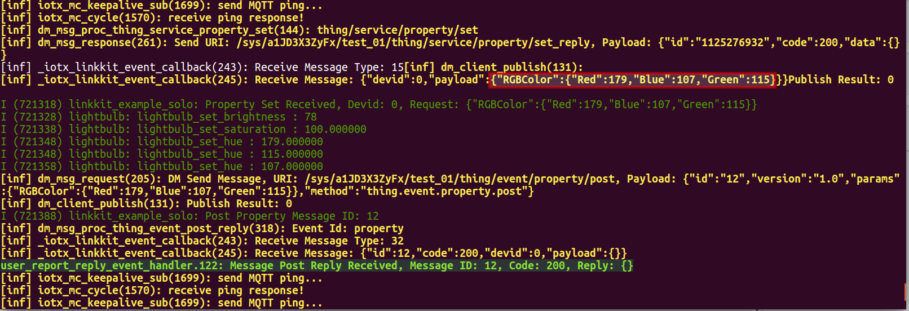

#### 11.重新配网
快速重启设备 5 次, 设备会擦除配置信息, 重新进入配网状态.

可以配置快速重启的次数和超时时间.
```
cd examples/solutions/smart_light
make menuconfig
```
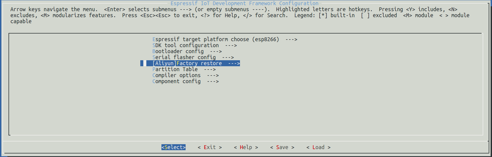
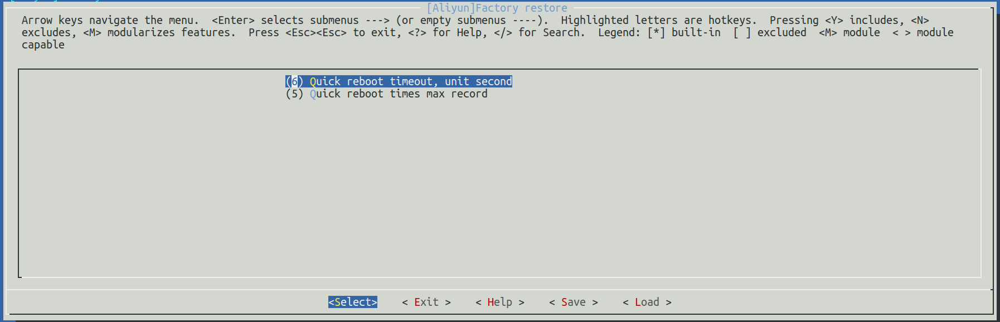

#### 12.OTA 支持
参考 examples/ota/ota_example_mqtt 示例下的 [README](../../ota/ota_example_mqtt/README.md) , 向管理控制台上传固件, 验证固件后, 下发升级指令.
设备端收到升级指令后, 即开始 OTA:
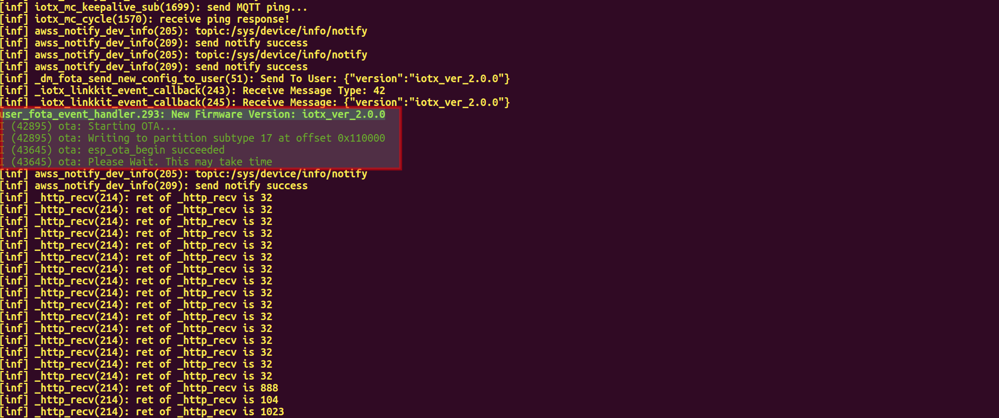

升级完成后, 会检查固件的有效性, 下图说明固件有效.
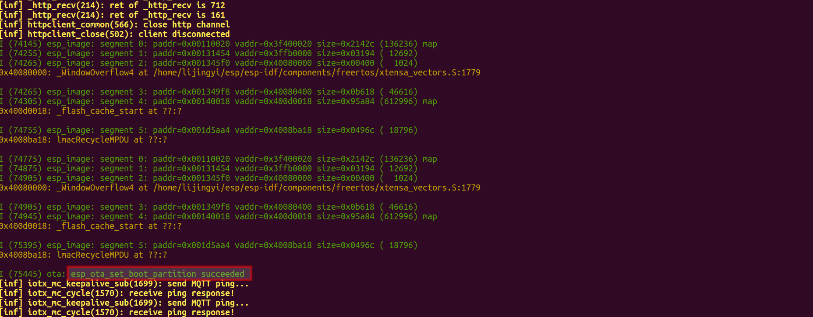

iotkit-embedded 目前没有设置软重启操作, 可以手动按模组重启键运行新固件:


#### 13.天猫精灵
##### 13.1 天猫精灵控制设备
针对使用公版 APP 的产品，用户可以一键开通天猫精灵，实现天猫精灵音箱对设备的控制. 使用步骤参照[阿里云文档](https://living.aliyun.com/doc#TmallGenie.html).
- 在阿里云 [生活物联网平台](https://living.aliyun.com/#/)上一键开通天猫精灵, 查看功能映射.
- 在 `云智能` [公版 APP]((https://living.aliyun.com/doc#muti-app.html))上绑定天猫精灵账号(即淘宝账号).  

注意最后步骤, 否则天猫精灵无法找到设备:
> 在天猫精灵 APP 找到 "阿里智能" 技能, 手动进行 "尝试" 或 "设备同步"(后期会进行自动同步)  
> 即可在 "我家" 的设备列表中看到您的设备

完成以上步骤后，您可以通过天猫精灵音箱控制您的设备了. 您可以对天猫精灵说 "天猫精灵,开灯", "天猫精灵, 关灯", "天猫精灵, 把灯调成红色" 或者其他您希望设置的颜色, 设备即响应相应的命令.

##### 13.2 天猫精灵配网并控制设备
阿里云设备支持 `零配` 的配网方式.  
使设备进入配网状态, 对天猫精灵说 "天猫精灵,发现设备"  
天猫精灵回复 "正在为您扫描, 发现了智能灯, 现在连接吗"  
对天猫精灵说 "连接" 或者 "是的"  
天猫精灵回复 "好的, 设备连接中, 稍等一下下哦"  
设备收到天猫精灵发送的管理帧配网信息, 进行联网:  
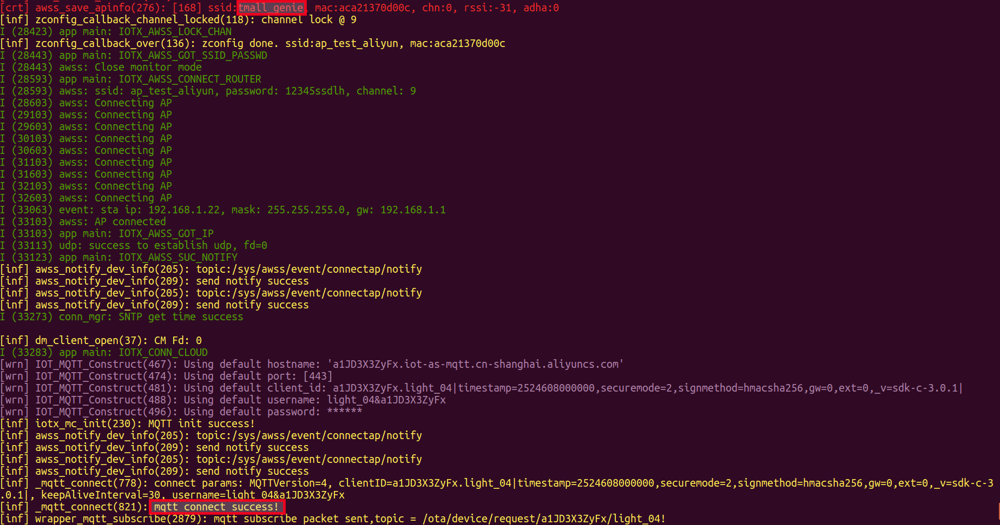

等待联网成功, 天猫精灵说 "智能设备联网成功, 现在用语音控制它试试", 这时您可以通过天猫精灵音箱控制您的设备了.

如果您之前通过云智能 APP 配网, 天猫精灵配网成功后, 云智能 APP 将不再显示设备. 如果继续通过云智能 APP 配网, APP 会配网失败, 显示 "设备添加失败, 设备已被管理员绑定, 请联系管理员解绑或将设备分享给您". 
> 在天猫精灵 APP 删除设备, 云智能 APP 再进行配网可以配置成功并显示设备.